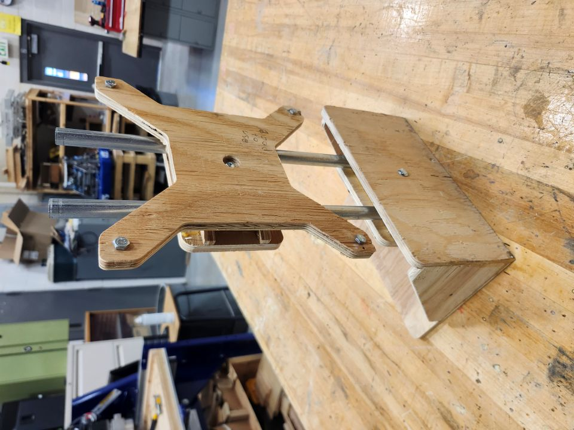

# How to make your own AprilTag stand 

## Designed by the coded summit

(What you need)

A ¼ ‘’ flat end mill.  
A ½ ‘’ pipe.  
¼ ‘’carriage bolts \- ¼ ‘’ wing nuts.  
Wood glue  
Half inch plywood.

(How to produce it)

You can produce 5 apriltags stands per 4’ x 8’ sheet of half inch plywood, for the pipe you can cut them at any length but I cut them at 20’’ if you want the exact ones,(you should cut the pipes to the desired length before glueing).  
 For the end mill I used a ¼’’ flat end mill.

Diameter 0.25’’  
Flute length 0.75’’  
Overall length 2.5’’

(How to glue it)

(just before you start gluing you should bore the hole in middle on the holder back, enough for the carriage bolt to sit flushed)

You shouldn’t worry about gluing the base front,bottom, and side brace to make the feet when it's time to glue those,I recommend doing this step first because the next step would need them to be glued, but when you’re  adding the brace you should do it at the same time as the clamp plate which is the next step .   

Next is to add the brace x4, and clamp plate, add glue to the pockets then brace’s then immediately clamp with the carriage bolt and wingnut to the feet with the pipe that you should've already cut, this is so that any misalignment from the braces can be avoided.

After the glue is settled you should start on the head, and do the same steps but with the holder back add glue to the pockets, add the braces, then immediately clamp them to the pipe so that any misalignment can be avoided from the braces.

(Production time)

Now time is relative but I was able to produce one apriltag stand in roughly around a day or 2 from getting all the parts and gluing them all to get the whole product.  
For producing the parts on a CNC, If you just kept the settings in and not change it you can produce one in 37m and 30s you can adjust this if you want it to produce it faster it's really up to you \\
